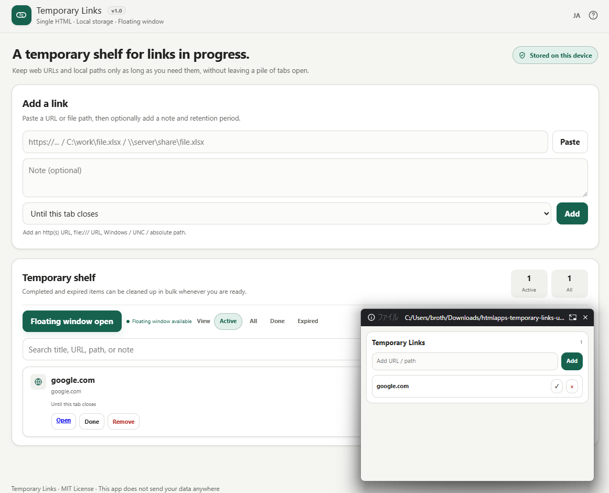

# Temporary Links

[English](README.md)



作業中だけ必要な **Webリンクやローカルファイルパスを一時置き** する、単一HTMLのブラウザーツールです。

長期保存するブックマーク管理ではなく、「いまの作業で使う参照先」をタブの代わりに置いておき、終わったら消すための小さな作業キューを想定しています。

## デモ

- [htmlapps-temporary-links](https://ttomohisa.github.io/htmlapps-temporary-links/)
- [temporary-links.html](https://ttomohisa.github.io/htmlapps-temporary-links/temporary-links.html) の直接URLも利用できます。

## 主な機能

- `temporary-links.html` 1ファイルで動作
- 実行時の外部依存なし
- Content Security Policy でアプリからの実行時通信を遮断
- リンク・メモ・パスはブラウザー内に保存
- 日本語 / 英語切替
- `http://` / `https://` のWebリンク
- `file:///...`、Windowsパス、UNCパス、絶対パス
- メモと保持期間
- 保持期間や完了状態を変えずに、既存のURL・パス・メモを編集
- 「このタブを閉じるまで」は `sessionStorage` に保存
- 永続データは既存の `temporary-links-v1` を継続利用
- 使用中 / すべて / 完了 / 期限切れの絞り込み
- タイトル・URL・パス・メモの検索
- ローカルパス、親フォルダー、ファイル名のコピー
- 全項目または現在の絞り込み・検索結果のMarkdown保存（件数・ファイル名のプレビュー付き）
- Document Picture-in-Picture によるフローティング表示
- スマホでも崩れにくいレスポンシブUI

## 使い方

1. `temporary-links.html` をダウンロードして開くか、GitHub Pages版を開きます。
2. Web URL またはローカルパスを貼り付けます。
3. 必要ならメモと保持期間を指定します。
4. **追加** を押します。

通常のリスト機能はローカルHTMLでも利用できます。フローティング表示で使っている Document Picture-in-Picture API は、対応ブラウザーの **安全なコンテキスト（HTTPS）** が必要です。この機能を使う場合は GitHub Pages 版などを利用してください。

## 参照先を編集する

各項目の **編集** から、URL・パスとメモを変更できます。**完了** や **期限切れ** の項目も編集できます。**保存** で元の項目を更新し、**キャンセル** または **Escape** で変更を破棄します。保持期間、完了状態、作成時刻、並び順、セッション／永続保存の区分は変わりません。別途入力中の追加フォームも保持されます。

変更後の参照先が別の使用中項目と重複する場合は保存できません。メモだけの変更や変更なしでの保存は可能です。クリップボード由来のリンク名は、参照先が同じなら保持され、変更すると解除されます。検索、Markdown保存、開いているフローティング表示にも更新が反映されます。

保存に失敗した場合は元の項目を変更せず、編集内容をダイアログに残します。再試行するか、内容をコピーしてからキャンセルしてください。編集中にフローティング側で削除された項目は復活しません。

## Markdownの保存

**その他**を開き、**すべての項目**または**現在の表示結果**を選びます。件数とファイル名を確認して、**Markdown保存**を押してください。

- **すべての項目**がページを開くたびの初期値です。両方の保存領域と完了・期限切れ項目を含み、従来の出力順と `temporary-links-YYYY-MM-DD.md` のファイル名を維持します。
- **現在の表示結果**は、現在の表示フィルターと検索に一致する項目を画面と同じ順序で保存します。ファイル名は `temporary-links-visible-YYYY-MM-DD.md` です。
- 表示結果が0件なら理由を示して保存を無効にし、全項目への切り替えは行いません。全項目では従来どおり空のMarkdownも保存できます。
- 範囲の選択はページを開いている間だけ保持します。一覧・検索・表示・言語を変えるとプレビューを更新し、保存ボタンを押した時点の内容を出力します。

成功メッセージはブラウザーでダウンロードを開始したことを示し、ディスクへの保存完了を保証するものではありません。開始時のエラーを検出した場合は再試行を案内し、一時リソースを解放します。

## 入力できるもの

| 種類 | 例 | 主な操作 |
|---|---|---|
| Web URL | `https://example.com` | 新しいタブで開く |
| File URL | `file:///C:/Users/name/report.xlsx` | ローカルパスをコピー |
| Windowsパス | `C:\work\report.xlsx` | パス / フォルダー / 名前をコピー |
| UNCパス | `\\server\share\report.xlsx` | パス / フォルダー / 名前をコピー |
| 絶対パス | `/Users/name/report.pdf` | パス / フォルダー / 名前をコピー |

通常のWebページから任意のローカルファイルやデスクトップアプリを直接開く動作はブラウザー制約の影響を受けます。そのため、ローカルパスには誤解を招く「開く」ボタンを付けず、コピー操作を提供しています。

## 保持期間

| 設定 | 保存方法 / 動作 |
|---|---|
| このタブを閉じるまで | `sessionStorage`。タブのセッション終了時に消えます |
| 今日まで | 当日の終わりに期限切れ |
| 3日後まで | 3日後の日末に期限切れ |
| 7日後まで | 7日後の日末に期限切れ |
| 削除するまで | 手動で削除するまで保持 |

期限切れの項目は **すべて** / **期限切れ** から確認でき、必要なタイミングで削除できます。

## 旧版データとの互換性

永続データのキーは引き続き次を利用します。

```text
temporary-links-v1
```

旧版で `expiresAt` が `session` だった項目は、初回読み込み時に新しいタブセッション用ストレージへ自動移行します。既存の永続リンクは手作業で移行する必要はありません。

## フローティング表示

安全なコンテキストで `window.documentPictureInPicture` が利用できる場合、**フローティング表示** から使用中の項目だけを小さな常時手前ウィンドウに出せます。

フローティング側では次の操作ができます。

- 使用中リンクの確認
- Webリンクを開く
- ローカルパスをコピー
- 完了にする
- 削除する
- URL / パスを「このタブを閉じるまで」で追加する

APIが利用できない環境ではボタンを無効化し、通常のリスト機能はそのまま使えます。

## プライバシーとオフライン動作

Temporary Links には、解析、テレメトリ、アップロード、リモートログ、CDN、実行時の外部依存を入れていません。

HTMLには `connect-src 'none'` を含む Content Security Policy を設定しています。Webリンクを開く操作はユーザーが明示的に行うページ遷移であり、アプリ自身がリンク先を取得することはありません。

ブラウザープロファイルを共用している場合、同じプロファイルを使う他の人からローカル保存内容を見られる可能性があります。暗号化された秘密情報の保管用途には使わないでください。

## リポジトリ構成

```text
htmlapps-temporary-links/
├── index.html                 # GitHub Pages ルート用リダイレクト
├── temporary-links.html       # アプリ本体・単一HTML配布物
├── README.md
├── README.ja.md
├── CHANGELOG.md
├── CONTRIBUTING.md
├── SECURITY.md
├── LICENSE
└── assets/
    └── social-preview.png
```

## 開発時の確認

このアプリにビルド工程はありません。公開前に以下を確認します。

1. `node --test` を実行（Node.js 24、依存追加なし）。インラインスクリプト、編集、保存範囲、入力検証、IME変換中のEnterを、DOM／ストレージ／PiP／ダウンロードのテスト用代替で確認します。実ブラウザーでの確認は別途必要です。
2. CDNや実行時ネットワーク依存がないこと
3. Web URL、`file:///`、Windowsパス、UNCパス、絶対パス
4. 各保持期間と4種類の絞り込み
5. 日本語 / 英語UI
6. ローカルHTMLでの通常機能と、HTTPSでのフローティング表示を分けて確認
7. 両方のMarkdown保存範囲、0件の表示結果、実際のIME入力・ダウンロード、削除確認ダイアログ

## ライセンス

MIT License。詳細は [LICENSE](LICENSE) を参照してください。

## バージョン表記

従来の `v1.0` 表示と変更履歴の `1.0` は `1.0.0` として扱い、今回のパッチは `v1.0.1` です。ビルド工程のない単一HTML構成はそのままです。言語切替の表示は **EN / JA** に統一し、切替先の説明とツールチップは現在の言語に合わせます。**完全ローカル処理** はアプリ内の処理を表し、保存したWebリンクを開く操作ではそのサイトへ移動します。
