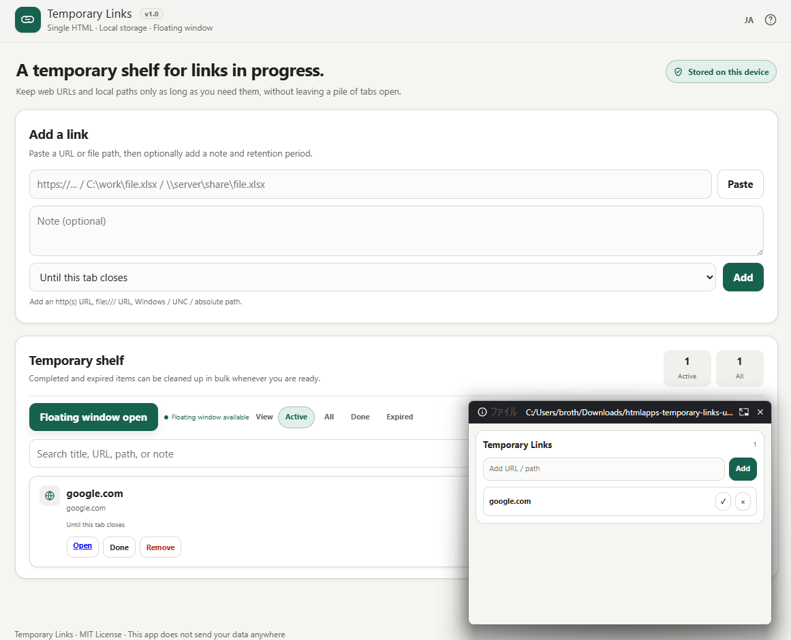

# Temporary Links


**Keep temporary links visible in an always-on-top floating window.**

Temporary Links is a self-contained, offline utility for collecting short-lived web links and local file paths while you work.

Its core feature is a compact **always-on-top floating window**, powered by the Document Picture-in-Picture API. Keep your active references visible while switching tabs, writing documents, sharing your screen, reviewing code, or using other desktop applications.

Open one HTML file in a modern browser, paste a URL or Windows file path, and send it to the floating window. No installation, build step, server, account, CDN, or network connection is required.

> **Not another bookmark manager.**  
> Temporary Links is a disposable, always-visible work queue for the links you need right now.


## Try it online

Open the hosted app:  
[https://ttomohisa.github.io/htmlapps-temporary-links/temporary-links.html)](https://ttomohisa.github.io/htmlapps-temporary-links/temporary-links.html)

Your links and file paths stay in your browser. Nothing is uploaded.

## Why Temporary Links?

Browser bookmarks are intended for links worth keeping. Open tabs are often used for links that are only needed for the current task, but that quickly creates tab overload.

Temporary Links is a small scratchpad for references that should be available now but do not belong in a permanent bookmark collection.

Typical uses include:

- Collect links while researching a topic
- Keep references available during a meeting or screen share
- Save links needed for a pull request, documentation update, or support task
- Hold product pages while comparing options
- Keep file paths that need to be opened later in Explorer, Run, VS Code, or another desktop application
- Close distracting tabs without losing the references temporarily

## Features

- Run as a single HTML file
- Work offline after opening the file
- Store data locally in browser storage
- Add `http://` and `https://` web links
- Add `file:///...` URLs, Windows paths such as `C:\work\file.csv`, and UNC paths such as `\\server\share\file.csv`
- Detect a copied link title when rich HTML link data is available in the clipboard
- Add an optional note to explain why a link was saved
- Set a lifetime: current session, today, 3 days, 7 days, or keep until removed
- Separate active, completed, and all saved items
- Mark items as done and restore them later
- Remove completed items or expired items in bulk
- Export the current list as Markdown
- Copy a local path, parent folder path, or file name
- Show an optional always-on-top floating window using Document Picture-in-Picture
- Add a link or path directly from the floating window
- Switch between dark and light themes
- Keep the main page and floating window synchronized
- Clear all saved Temporary Links data from browser storage

## Quick start

1. Download `temporary-links.html` from this repository.
2. Open it in Chrome or Microsoft Edge.
3. Paste a web URL or a local file path into the input field.
4. Optionally add a note and choose how long to keep the item.
5. Select **Add**.
6. Optionally select **Open floating window** to keep active items visible while working.

There is no upload. Links, notes, and file paths remain in browser-local storage.

## Web links and local paths

Temporary Links intentionally treats web links and local paths differently.

| Item type | Examples | Main action |
|---|---|---|
| Web link | `https://example.com` | Open in a new browser tab |
| File URL | `file:///C:/Users/name/Documents/report.xlsx` | Copy the Windows path |
| Windows path | `C:\Users\name\Documents\report.xlsx` | Copy the path, folder, or file name |
| UNC path | `\\server\share\report.xlsx` | Copy the path, folder, or file name |

Browsers cannot reliably open arbitrary local files in Explorer or their associated desktop applications from a normal web page. For that reason, local paths are stored as references and provide copy actions instead of a misleading **Open** action.

After copying a path, paste it into one of the following:

- File Explorer address bar
- Windows Run dialog with `Win + R`
- VS Code Quick Open
- A terminal
- Any desktop application that accepts file paths

## Floating window

The optional floating window uses the Document Picture-in-Picture API.

It is useful when you want active links to remain visible while working in another browser tab or desktop application.

The floating window provides:

- A compact, one-line view for every active item
- Quick completion and removal controls
- Copy controls for local paths
- A small input field for adding a URL or path
- Theme synchronization with the main window

The app uses the phrase **floating window** in the interface rather than the technical term “PiP”.

## Browser support

| Feature | Recommended browser |
|---|---|
| Core link and path storage | Current Chrome, Edge, Firefox, or Safari |
| Clipboard button | Current Chromium-based browser; direct paste remains available elsewhere |
| Floating window | Current Chrome or Microsoft Edge on desktop |
| Local path copy fallback | Most modern desktop browsers |

The floating window depends on the experimental Document Picture-in-Picture API. If it is unavailable, Temporary Links continues to work as a normal single-page tool.

## Data storage and expiry

Temporary Links stores its data in `localStorage` under the key:

```text
temporary-links-v1
```

The app supports these retention options:

| Retention | Behavior |
|---|---|
| This session | Removed when the page is closed or reloaded |
| Until today | Expires at the end of the current day |
| 3 days | Expires at the end of the third day |
| 7 days | Expires at the end of the seventh day |
| Keep until removed | Remains until manually removed or cleared |

Expired items remain visible in the **All** view until removed. Use **Clear expired** to remove them in one action.

Selecting **Clear all** removes all Temporary Links items and deletes the app's `localStorage` entry.

## Privacy

Temporary Links is designed to be private by default.

- Links, file paths, notes, and settings are stored locally in the browser.
- No data is uploaded to a server.
- No account is required.
- No analytics, telemetry, remote logging, or tracking is included.
- The app can run from a local `file://` URL.
- The app does not inspect whether a local file exists.
- The app does not open local files through Explorer or desktop applications.

Be aware that browser-local storage may be available to other people using the same browser profile on the same computer. Clear the list after working with sensitive links or file paths.

## Markdown export

The **Export Markdown** action downloads the current list in a simple format:

```md
- [Example title](https://example.com) — Optional note
- [report.xlsx](C:\Users\name\Documents\report.xlsx)
```

Completed entries are marked with `_(Done)_`.

This is useful for moving a short-lived research list into project notes, an issue, a pull request, or a task tracker before clearing the shelf.

## Limitations

- The app cannot reliably open a local file in File Explorer or its desktop application because browsers restrict this for security reasons.
- Local path existence cannot be checked from a standalone browser page.
- Web page titles cannot always be fetched from URLs because many sites block cross-origin requests; titles are detected only when copied link data includes them.
- The floating window is not supported by all browsers and is primarily intended for desktop Chrome and Edge.
- Browser storage can be cleared by browser settings, profile cleanup, or private/incognito session behavior.
- The app is intended for temporary references, not long-term bookmark management or encrypted secret storage.

## Development

The distributable is deliberately a single, self-contained HTML file.

If you modify it directly, keep these principles intact:

- Keep it usable without a build step.
- Keep runtime styles and scripts embedded in the HTML file.
- Do not add server dependencies.
- Do not add analytics, telemetry, uploads, or remote logging.
- Preserve offline behavior where browser capabilities allow it.
- Test both dark and light themes.
- Test normal links, `file:///` URLs, Windows paths, and UNC paths.
- Test empty, active, completed, and expired list states.
- Test the floating window independently from the main page.
- Test with browser network access disabled.
- Test local storage clearing and Markdown export.

## Project structure

```text
temporary-links/
└── temporary-links.html
```

## License

Copyright (c) 2026 Tomohisa Takagi.

This project is licensed under the MIT License.

## Contributing

Bug reports, UX improvements, and pull requests are welcome.

When reporting an issue, please include:

- Browser name and version
- Operating system
- Whether the issue occurs from a hosted page or a local `file://` page
- Whether the floating window was open
- Whether the item was a web link, `file:///` URL, Windows path, or UNC path
- A minimal reproduction if possible

Please remove sensitive URLs, file paths, names, tokens, and internal hostnames before sharing screenshots or reproduction data.